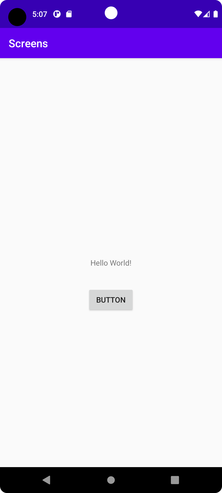
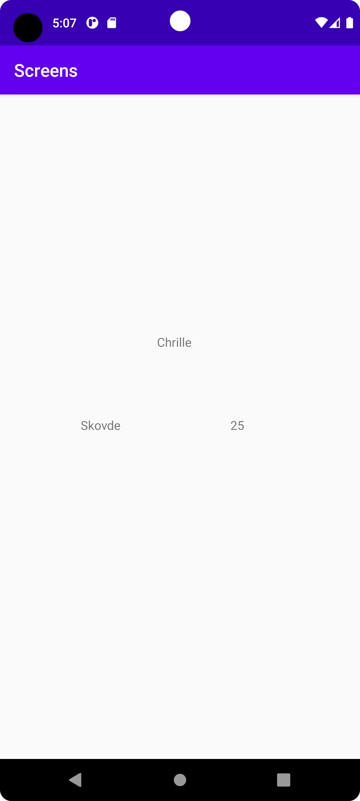

# Rapport

I det här projektet så började jag med att skapa ett andra activity. Sedan skapades
en knapp i den första activityn som startar den andra activityn med hjälp av intent. 
Sedan skapades en bundle för att kunna skicka över data till den andra activityn. 
Därefter lade jag till tre textviews i den andra activityn för att kunna visa de 
olika strings i bundlen.

## Följande grundsyn gäller dugga-svar:

- Ett kortfattat svar är att föredra. Svar som är längre än en sida text (skärmdumpar och programkod exkluderat) är onödigt långt.
- Svaret skall ha minst en snutt programkod.
- Svaret skall inkludera en kort övergripande förklarande text som redogör för vad respektive snutt programkod gör eller som svarar på annan teorifråga.
- Svaret skall ha minst en skärmdump. Skärmdumpar skall illustrera exekvering av relevant programkod. Eventuell text i skärmdumpar måste vara läsbar.
- I de fall detta efterfrågas, dela upp delar av ditt svar i för- och nackdelar. Dina för- respektive nackdelar skall vara i form av punktlistor med kortare stycken (3-4 meningar).

Programkod ska se ut som exemplet nedan. Koden måste vara korrekt indenterad då den blir lättare att läsa vilket gör det lättare att hitta syntaktiska fel.

```
        Button button = (Button) findViewById(R.id.button);
        button.setOnClickListener(new View.OnClickListener() {
            @Override
            public void onClick(View view) {

                Bundle bundle = new Bundle();
                bundle.putString("NAME", "Chrille");
                bundle.putString("CITY", "Skovde");
                bundle.putString("AGE", "25");

                Intent intent = new Intent(MainActivity.this, MainActivity2.class);

                intent.putExtras(bundle);
                startActivity(intent);

            }
        });
        
        
        Intent intent = getIntent();
        Bundle bundle = intent.getExtras();
        String name = bundle.getString("NAME");
        String city = bundle.getString("CITY");
        String age = bundle.getString("AGE");
        TextView textview = (TextView) findViewById(R.id.textView2);
        TextView textview2 = (TextView) findViewById(R.id.textView3);
        TextView textview3 = (TextView) findViewById(R.id.textView5);
        textview.setText(name);
        textview2.setText(city);
        textview3.setText(age);
        
```

Bilder läggs i samma mapp som markdown-filen.





Läs gärna:

- Boulos, M.N.K., Warren, J., Gong, J. & Yue, P. (2010) Web GIS in practice VIII: HTML5 and the canvas element for interactive online mapping. International journal of health geographics 9, 14. Shin, Y. &
- Wunsche, B.C. (2013) A smartphone-based golf simulation exercise game for supporting arthritis patients. 2013 28th International Conference of Image and Vision Computing New Zealand (IVCNZ), IEEE, pp. 459–464.
- Wohlin, C., Runeson, P., Höst, M., Ohlsson, M.C., Regnell, B., Wesslén, A. (2012) Experimentation in Software Engineering, Berlin, Heidelberg: Springer Berlin Heidelberg.
